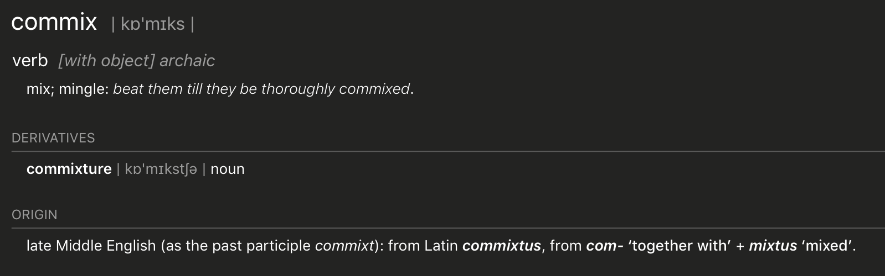

# commix

Code for the paper:

Corina Dima, Daniël de Kok, Neele Witte, Erhard Hinrichs. 2019. [No Word is an Island — a Transformation Weighting Model for Semantic Composition](https://arxiv.org/abs/1907.05048). Transactions of the Association for Computational Linguistics 2019.

Creating phrasal representations, and in particular representing 
low-frequency phrases like *purple car* is a task for
composition models of distributional semantics. A composition model is
a function *f* that combines the vectors of individual words, e.g. **u** for
*black* and **v** for *car* into a phrase representation **p** (*black car*):

**p** = *f*(**u**, **v**)

The project contains implementations for a range of existing composition models and the new model proposed in the paper. 
The models can be used to construct the vectorial representations for different syntactic constructions, for example compounds (*apple tree*), adjective-noun phrases (*black car*) or adverb-adjective phrases (*very large*).
The paper gives further details about the different composition models and experiments on different phrase types and languages.

### Prerequisites

The code is written in [Python](https://www.python.org) and uses the  [TensorFlow](https://www.tensorflow.org) library. To use the program the following prerequisites need to be installed.
- Python 3.7
- TensorFlow 1.13.1
- gensim 3.7.3
- keras 2.2.4

The code can be ran on a CPU or GPU.

### Training

A composition model can be trained with
```
python training.py embeddings dataset_directory --composition_model --save_path
```
- `embeddings` the path to the file that contains word embeddings of the format: .bin/.txt /.w2v

- `data_dir` the path to the directory that contains the phrase dataset (train/test/dev splits)

- `--composition_model` composition model to be used. Available models are *addition, bilinear, scalar_addition, vector_addition, matrix, fulllex, wmask, trans_weight, trans_weight_transformations, trans_weight_features, trans_weight_matrix*

- `--save_path` defines the directory the trained models and predictions are saved to. If not specified, these are saved to ./trained_models

For other available options, see the help:
```
python training.py -h
```
To evaluate a trained composition model run
```
python evaluation.py embeddings predictions ranks
```
- `embeddings` the path to the file that contains word embeddings of the format: .bin/.txt /.w2v

- `predictions` the path to the file were the predictions for a dataset are stored

- `ranks` the path to the file were the rank for each instance is saved to

### Composition Datasets

Several composition datasets were used to evaluate the composition models on English, German and Dutch. The majority of the datasets are available [here](http://hdl.handle.net/11022/0000-0007-D3BF-4).

### Project Name

The project name is a portmanteau from the words *composition* and *mix*. It is also a (archaic) verb, meaning *to mix, to mingle*. The project name is pronounced just like the word *comics*.



### License
Apache License v2.0
